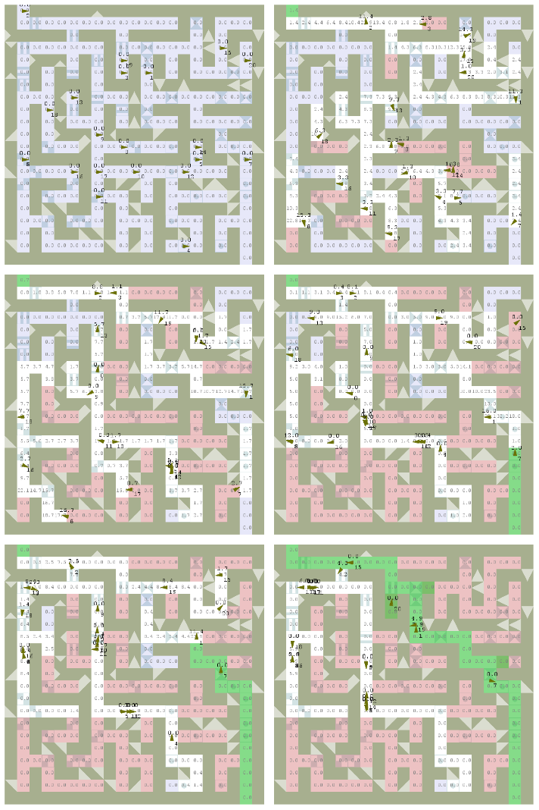

# swarm_maze_opencl_solver
&nbsp;&nbsp;&nbsp;&nbsp;&nbsp;&nbsp;This is my diploma project called "A GPU-Accelerated stigmergic BCMM swarm". In short, it is a Python maze solver, that simulates a swarm on GPU using OpenCL. Swarm agents use neural networks to navigate in an unknown environment.
 &nbsp;&nbsp;&nbsp;&nbsp;&nbsp;&nbsp;The report abstract below outlines goals and motivation of the project. For documentation on the code, GUI and the project overall, refer to the [report extract PDF](Report_extract.pdf) stored in this repo. The extract contains Abstract, partial Design and Implementation sections; for other sections such as Literature Review and Evaluation, contact me via naums.mogers@gmail.com.
 &nbsp;&nbsp;&nbsp;&nbsp;&nbsp;&nbsp;The project was developed using Python 3.4.2, OpenCL 1.2 (the code should be 1.0-compatible), PyOpenCL, Pygame, Numpy and FFmpeg. The platform is 64-bit Windows 7 and AMD Radeon HD 7870.
 &nbsp;&nbsp;&nbsp;&nbsp;&nbsp;&nbsp;This work is distributed under MIT License: you are free to use and change it with appropriate references to the source.
<h3>Simulation demo</h3>
https://www.youtube.com/watch?v=HpRFR8ApPjU
 https://www.youtube.com/watch?v=5vmqxHJ6SdQ

<h3 align="center">Report abstract</h3>
&nbsp;&nbsp;&nbsp;&nbsp;&nbsp;&nbsp;Multiple studies describe the efficiency of swarm systems in nature, such as ant foraging and termite nest building. These systems are simple, robust and fault-tolerant; their models are successfully applied to solving various problems in mathematics and computer science. This report proposes a stigmergic swarm intelligence system based on a model of an ant colony. The system is shown to be effective at mapping the maze.
 &nbsp;&nbsp;&nbsp;&nbsp;&nbsp;&nbsp;Agents of the proposed swarm are augmented using the Binary Correlation Matrix Memory (BCMM), which is used to navigate in an unknown heterogeneous environment. The agents are able to learn and recognize different types of objects in an unsupervised fashion using the trial and error method.
 &nbsp;&nbsp;&nbsp;&nbsp;&nbsp;&nbsp;The system is evaluated using a GPU-accelerated simulator, which is also developed within this project. The simulator takes advantage of GPU parallelization by simulating each agent on a separate GPU processor.
 &nbsp;&nbsp;&nbsp;&nbsp;&nbsp;&nbsp;An evaluation of the swarm intelligence system concludes with an optimal swarm density per maze square; BCMM is shown to implement quick learning with a compact input data encoding. Finally, the simulator performance is evaluated under varied workloads.
